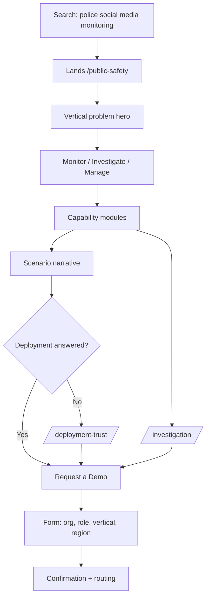
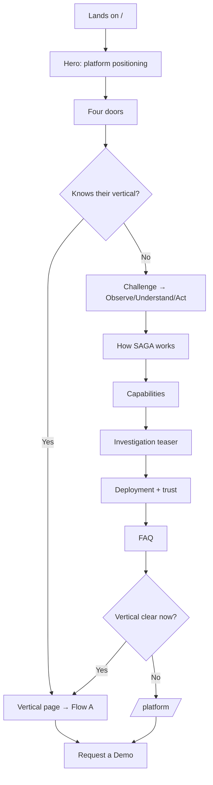
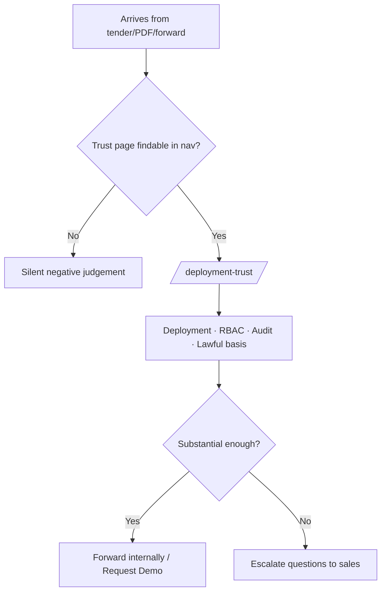
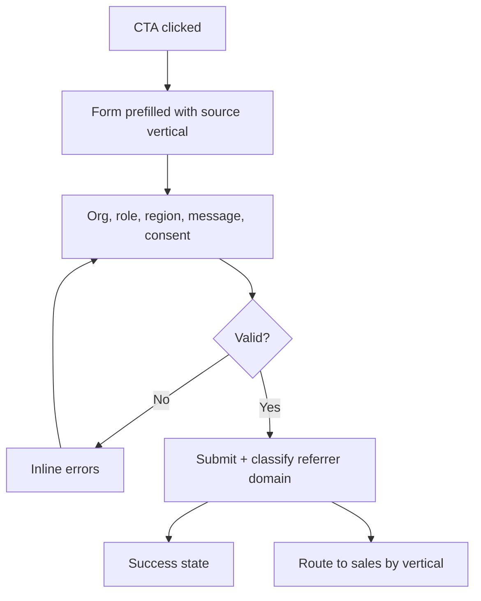

# Blura SAGA Website — Product Plan

**Version:** 1.0 · Planning
**Owner:** Solo build
**Success metric:** Demo requests originating from government / police domains

---

## Overview

The current SAGA website is a well-executed mood piece with almost no product inside it. It reads beautifully and says nothing a procurement officer can evaluate. Six capability cards — Sentiment, Intent, Narratives, Threats, Relationships, Context — describe a category, not a product; any social listening tool on the market claims all six. Meanwhile the 24-page internal deck contains a POI database with FIR linkage, Telegram group infiltration, EXIF GPS extraction, frame-level deepfake forensics, a five-tier unrest predictor, Dial 100 correlation and department-level grievance SLAs. None of it reaches the site.

This plan does not treat "four separate homepages" as the fix. The proposed vertical split is directionally right but structurally wrong: the failure is content depth, not navigation, and four homepages of the current copy would multiply the emptiness fourfold at four times the maintenance cost for a solo builder.

**The approach:** one narrative homepage with the four-vertical selector moved high (honouring the original instinct without gating), four deep and independently linkable vertical pages built from a single shared template, and a hard pivot in content strategy — operational scenario narratives replace the product screenshots the site is not permitted to show.

**Constraints this plan is built around:**

| Constraint | Source | Consequence |
|---|---|---|
| No product UI; abstract data-viz only | Confirmed | Proof must come from language specificity + scenarios, not visuals |
| Deployment "varies per deal" | Confirmed | Requires one published umbrella statement, not silence |
| Public Safety → Governance → Brands → Celebrity by revenue | Confirmed | Drives hero framing, build order and content depth allocation |
| India-primary, international secondary | Confirmed | Indian examples, Indian language support, Indian legal framing lead |
| Site naming wins (Public Safety / Governance) | Confirmed | Deck + 5 one-pagers must be re-versioned |
| Reputation Shield + client logos gated | Confirmed, with dissent recorded | See Open Questions — gating is insufficient for one, wrong for the other |
| Solo builder, urgent | Confirmed | Shared template mandatory; "all four equally deep" reinterpreted (below) |
| Light theme: white base, orange accent, navy retained | Confirmed | Full inversion of the current dark site; see Visual System |

---

## Design Critique of the Current Site

Grounded in the full-page capture. Ordered by severity.

### First impression
The hero asks *"Trying to see what people are saying about your brand?"* Your named references are US defence agencies, Ghana Government, Punjab Police, Telangana Police (Narcotics), Andhra Pradesh Narcotics and a Minister of State for Home Affairs. The first screen sells to the fourth-ranked vertical. A DGP who lands here concludes within two seconds that this is a marketing tool.

### Information density vs scroll cost
Observe, Understand and Act occupy three full-viewport panels and carry roughly thirty words between them. Each panel is a ghost word in 300px type, one orange headline, and two lines of body copy. This is three screens of scroll for one paragraph of information. The capture's large black voids are scroll-triggered content that didn't fire in print — which is itself the finding: content that exists only inside a scroll trigger does not exist for print, for low-power devices, for reduced-motion users, or for anyone skimming under time pressure. Government buyers skim under time pressure.

### Structural ordering error
The FAQ block ("What is SAGA?", "Who is SAGA for?") sits *after* the Governance deep-dive and *before* the vertical selector. The site answers the entry-level question two-thirds of the way down, after already having sent the visitor into a specific vertical. Reading order is inverted.

### Vertical treatment is unbalanced
Governance receives a full section — icon diagram, four "what SAGA helps you understand" cards, a closing statement. Public Safety, Brands and Celebrity receive one card each in "Which one of these is you?" and a footer link. The revenue-leading vertical has the thinnest treatment on the page.

### Hierarchy and consistency
The type system is sound: consistent orange headline / white sub / dim body, disciplined eyebrow labels, good use of numbered indices (01–06). Card treatment is consistent. This is the part worth keeping. Two defects: the capability cards use three text weights (title / bold one-liner / dim paragraph) where two would read faster, and the numbered card indices are set so small and so dim they function as decoration rather than wayfinding.

### Accessibility
- Contrast on the current dark theme needs measuring against the actual CSS rather than assumed. A representative mid-grey on black returns roughly 6:1 and passes; the dim orange eyebrow labels and the very small numerals are the likely failures. This becomes moot on the light theme, but the same discipline applies to the new palette.
- Risk and status states will be communicated by orange alone unless deliberately paired with label or shape.
- The 300px ghost words (Observe / Understand / Act) will be read aloud by screen readers as content, interrupting the actual copy. They must be `aria-hidden`.
- Every scroll-triggered reveal needs a `prefers-reduced-motion` static state — not a disabled animation, a static composition that reads correctly.

### What is genuinely working, and what happens to it
The console render on screen two is the single most credible object on the site. The type system — consistent headline/sub/body weights, disciplined eyebrow labels, numbered indices — is sound and transfers directly to the light theme.

The black/orange palette itself is being replaced by decision. That trade is worth naming honestly: black/orange was distinctive in a category of navy-and-cyan, and dark canvas was carrying the glow-based abstract visuals that substitute for the product screenshots the site can't show. Navy recovers both — the visualisations move onto deep navy display panels set into the white page rather than onto white. The compensating gain is real: every Blura one-pager is already navy panels with red-orange accents on white, so the site and the collateral become one brand for the first time.

---

## Visual System

Values sampled directly from `Blura_SAGA_logo.png`. Contrast ratios computed, not estimated.

### What the logo actually contains

| Role in mark | Hex | Note |
|---|---|---|
| Wordmark, microphone stem | `#1E2A4C` | Navy — the dominant brand colour |
| Tagline, "BLURA" plaque, globe landmass | `#C13C4C` | Crimson |
| Globe upper-left highlight | `#F9CB65` | Pale amber, gradient terminus only |

**The logo contains no orange.** The site accent (`#F2531B` family) is a web-only colour with no basis in the mark. That is a legitimate choice, but it must be a deliberate one: the site runs a colour system the logo does not, and navy is the bridge that keeps them related.

### Token set

```css
:root {
  /* Surfaces */
  --surface:            #FFFFFF;  /* primary page */
  --surface-subtle:     #F5F6F8;  /* alternating sections, cards */
  --surface-display:    #141C33;  /* navy panels for data-viz + hero */
  --surface-display-alt:#1E2A4C;  /* logo navy, secondary panels */
  --border:             #E2E5EB;

  /* Ink */
  --ink:                #1E2A4C;  /* headings + body on light — 14.09:1 */
  --ink-muted:          #5A6377;  /* secondary on light — 6.02:1 */
  --ink-inverse:        #FFFFFF;  /* on navy — 16.89:1 */
  --ink-inverse-muted:  #A8B0C4;  /* on navy — 7.78:1 */

  /* Brand accent — interactive + identity ONLY */
  --accent:             #F2531B;  /* fills, CTA backgrounds, graphics */
  --accent-text:        #C4400F;  /* orange TEXT on light — 5.14:1 */
  --accent-on-navy:     #F2531B;  /* orange on navy — 4.85:1, passes */

  /* Risk scale — never uses --accent */
  --risk-calm:          #2E7D5B;
  --risk-watch:         #B8860B;
  --risk-elevated:      #C25E00;
  --risk-high:          #C13C4C;  /* logo crimson */
  --risk-critical:      #8E1F30;
}
```

### Hard rules

1. **`--accent` is never body text on white.** `#F2531B` on `#FFFFFF` measures **3.48:1** and fails AA. Use it for CTA fills, iconography, rules and graphic elements. For orange text on light, use `--accent-text` (5.14:1).
2. **Brand orange never appears inside a risk visualisation.** Orange is reserved for interactive and identity. If it also encodes "elevated," an orange gauge segment stops reading as a warning. The risk ramp is its own family, topped by the logo crimson.
3. **Risk states pair colour with a text label.** Colour alone fails for colour-blind users and in print — and these pages will be printed and forwarded inside government departments.
4. **Navy panels carry the visual layer.** All abstract data-viz, the hero, and section dividers live on `--surface-display`. Nothing luminous is attempted on white.
5. **Navy is structural, not decorative.** It is the ink colour for all headings and body copy, and the surface colour for display panels. This is what earns its keep and keeps the logo related to the site.

### Page rhythm

Alternate `--surface` → `--surface-subtle` → `--surface-display` down the page. On a vertical page: white hero copy block, subtle capability modules, navy display panel for the signature visualisation, white scenario narratives, subtle FAQ, navy final CTA. This gives each page structure without extra design work, and prevents the eight-identical-white-sections failure mode.

### Logo mechanics

- **A reversed/white lockup is required.** The current site boxes the full-colour logo in a white rounded rectangle on black in both nav and footer — the standard tell that no transparent or reversed asset exists. On the light theme the primary lockup works as-is; the reversed version is needed for navy panels and the footer.
- **A small-size mark is required.** At nav scale (~40px height) the word "BLURA" inside the crimson plaque is illegible. Produce a simplified lockup — globe plus SAGA wordmark, plaque text dropped — for anything under ~64px.
- **Globe gradient vs site accent.** The amber→crimson globe sits within 200px of orange CTAs in the header. Either accept the crimson/orange adjacency deliberately (they are close enough to read as one warm family) or use the mono navy lockup in the nav and reserve the full-colour mark for the footer and print.

### Typography
The existing type system transfers unchanged — geometric sans, orange-or-accent headline / navy sub / muted body, uppercase letterspaced eyebrow labels, numbered indices. Two fixes carried over from the critique: reduce capability cards from three text weights to two, and increase the size and contrast of the numbered indices so they function as wayfinding rather than decoration.

---

## Market & User Research

### Direct competitor — Innefu Labs (India, closest analogue)
Sells OSINT (Innsight), predictive policing (Prophecy Alethia), forensics (Argus), CDR/IPDR analytics (InteleLinx) and an air-gapped sovereign AI appliance to Indian police, intelligence and defence. Their website strategy under the same "can't show much product" constraint:

- **One named product per mission.** Not one platform with four soft labels — distinct product names a tender document can reference.
- **Operational narratives as proof.** A published account of an OSINT-led narcotics interdiction, ending in a pre-dawn seizure with compartments welded into a vehicle undercarriage. Specific, verifiable-feeling, memorable.
- **Air-gapped / on-premise sovereign deployment as a headline capability**, not a footnote.
- **Heavy SEO content layer** — long-form articles on OSINT for drug trafficking, social media intelligence, radicalisation — capturing search intent that a brochure site cannot.

**Implication:** their moat on the web is specificity and story. SAGA has richer raw material (grievance lifecycle, unrest prediction, constituency mapping, Dial 100 correlation) and is currently publishing less of it.

### Direct competitor — Babel Street (international benchmark)
Structure: Platform / Solutions / Data top-level nav; sector solution pages (Government, Law Enforcement) that mirror a vertical structure; hard numbers in headlines (200+ languages; a stated analyst-efficiency figure); FAQ accordions on every solution page for search capture; a named **"Flexible Deployment Options"** section. Positioning built on a single ownable phrase ("the Risk-Confidence Gap").

**Implications:** (1) the four-vertical structure is standard and validated, (2) FAQ-per-vertical-page is a cheap high-yield SEO pattern, (3) "Flexible Deployment Options" is the exact solution to the "varies per deal" answer — a single umbrella statement that covers every deal shape without committing to one.

### Buyer context — Indian public safety
Procurement runs through tenders and empanelment; state police OSINT and social-media-monitoring tenders are an established category with published requirement documents. Two consequences for the site:

1. **The site rarely originates the deal — it validates it.** A committee opens the site mid-evaluation to check the vendor is real. It must survive that read. This does not conflict with the demo-request metric; it precedes it.
2. **Search intent is literal.** Buyers search "OSINT platform for police India", "social media monitoring police", "law enforcement social media intelligence" — not "public safety intelligence". Page copy must carry the literal terms even where the brand name is softer.

### Reputational environment
Indian AI-policing vendors are under active press scrutiny over accountability and oversight gaps in police AI procurement, with named vendors. This is the publishing environment. It argues for a visible lawful-basis and governance posture on the site, and against publicly marketing any capability that reads as manipulation.

### Pattern conventions the site currently breaks
- Solution/vertical pages should be individually URL-addressable and indexable. A JS-gated chooser in front of content breaks this.
- Enterprise/government buyers expect deployment, security and data-handling answers to be findable without a sales call.
- Category convention is a persistent nav CTA plus at least one deep proof artifact per vertical.

---

## Requirements

### Must Have

**Structure**
- M1 — Four vertical pages at stable, indexable URLs (`/public-safety`, `/governance`, `/brands`, `/celebrity`), each reachable directly without passing through a selector.
- M2 — Vertical selector positioned immediately after the homepage hero, not at the page foot and not as a gate.
- M3 — Single shared vertical page template driving all four pages.
- M4 — Homepage hero reframed to platform level with public-safety/government primacy in supporting copy; the brand-facing hero question is removed.
- M5 — The four-stage pipeline (Ingestion → AI Processing → Risk Scoring → Action & Reporting) published on the homepage. Currently absent from the site entirely despite being the clearest explanation of the product that exists in any source material.

**Content**
- M6 — Minimum two operational scenario narratives per vertical page, written from deck source, anonymised and marked illustrative. This is the designated substitute for product screenshots.
- M7 — Capability copy rewritten to mechanism-level specificity. Every capability statement must name what the system actually does — verdict states, score ranges, alert tiers, workflow stages, extraction types — not the outcome category.
- M8 — Deployment & Trust page: one umbrella deployment statement covering on-premise, sovereign cloud and managed SaaS; data handling; access control model (Super Admin / Level-2 / Level-1); audit trail; lawful-basis statement.
- M9 — FAQ block on each of the four vertical pages, written against literal search phrasing.
- M10 — Demo form capturing organisation, role, vertical of interest and region, with the source page persisted in hidden metadata so gov/police-origin leads are measurable.

**Compliance / risk**
- M11 — Every numeric claim (100M+ conversations daily, 8+ countries) either verified with a named owner and date, or removed. No exceptions for SEO value.
- M12 — "Court-admissible", "tamper-proof", "legally defensible" replaced with defensible process language (evidence-grade workflows, immutable audit trail, timestamped capture with metadata) unless legal signs off in writing.
- M13 — Named government and police clients replaced with unnamed descriptors on all public surfaces.

**Accessibility**
- M14 — All body copy measured to ≥4.5:1 contrast; adjust the dim grey.
- M15 — Every animated section has a static composition that reads correctly under `prefers-reduced-motion`.
- M16 — No content exists only inside a scroll trigger or canvas layer.

### Should Have
- S1 — Platform page: the intelligence pipeline in depth, the three-layer architecture, RBAC, RSS intelligence engine.
- S2 — Investigation & OSINT page: SOC-EYE, deepfake detection, username enumeration, EXIF/location, email and phone intelligence, cross-platform search.
- S3 — One signature abstract data-viz per vertical, differentiated by vertical (constituency-style map for Governance, threat density for Public Safety, sentiment trajectory for Brands, network graph for Celebrity).
- S4 — Multilingual capability stated explicitly with named languages (English, Telugu, Hindi, Urdu) rather than a generic "multi-language support" chip.
- S5 — Persistent nav CTA on desktop, fixed CTA on mobile.
- S6 — Custom 404 and form error/success states.

### Could Have
- C1 — Capabilities page with vertical filtering.
- C2 — Resources / insights hub for SEO content (the Innefu-style long-form play).
- C3 — About / company page.
- C4 — Industries page beyond the four verticals (transport, healthcare, campus).
- C5 — CMS layer.

### Won't Have (this phase)
- W1 — Any gated interstitial or vertical chooser preceding content.
- W2 — Product screenshots or real product UI, per confirmed constraint.
- W3 — Pricing.
- W4 — Any public mention of Reputation Shield / Bulk X Actions (see Open Questions — this overrides the "gate it" instruction and needs an explicit decision).
- W5 — Named client logos on public pages.
- W6 — Case studies (blocked on client consent).
- W7 — Live chat, multi-language site UI, customer portal.

### Non-Functional Requirements
- Four vertical pages must be server-rendered or statically generated for indexability. If the current build is client-rendered SPA with scroll-driven content injection, this is the single biggest technical decision on the project.
- Lazy-load all heavy visual assets below the fold; hero must render meaningful content without waiting on the animation layer.
- Mobile: replace 3D/particle scenes with static or short-motion equivalents rather than scaling them down.
- Form endpoint with validation, spam protection and consent capture.
- Analytics: CTA clicks by page and vertical, form starts, form completions, vertical selected, referrer domain classification (gov/police vs other).

---

## UX Strategy

### Design principles

1. **Specificity is the proof.** With no product UI permitted, every abstraction is a liability. "Verdict: REAL / FAKE / SUSPICIOUS with frame-level forensic breakdown" earns trust; "Know what the signals mean" does not. Where a sentence could equally describe a competitor, rewrite it.

2. **Scroll must be paid for in information.** The current Observe/Understand/Act sequence spends three viewports on thirty words. Every full-viewport section must deliver a discrete, nameable piece of product knowledge.

3. **Four doors, no gate.** The visitor should see all four worlds within one scroll of landing and be able to enter any of them in one click — but never be blocked from the platform story to make that choice.

4. **Write for the buyer who arrived sideways.** Most qualified traffic lands mid-site from a PDF link, a search result or an email. Every vertical page must stand alone: it needs its own problem framing, its own proof and its own CTA, assuming zero homepage context.

5. **Restraint reads as seriousness.** In a category under press scrutiny, over-claiming is a commercial risk, not just an ethical one. Understatement with specificity outperforms superlatives with vagueness for this buyer.

### Information architecture

```
/                      Home — platform narrative + four doors
/platform              How it works, architecture, RBAC, RSS engine
/public-safety         Vertical (deep)
/governance            Vertical (deep)
/brands                Vertical (medium)
/celebrity             Vertical (medium)
/investigation         Investigation & OSINT
/deployment-trust      Deployment, security, data handling, lawful basis
/contact               Demo request
```

**Top navigation:** Platform · Solutions ▾ · Investigation · Trust · **Request a Demo**
Solutions opens a four-item menu with one-line descriptors. Capabilities is deliberately not a top-level item in this phase — it duplicates Platform and costs a solo builder a page for little return.

### Homepage sequence

| # | Section | Purpose | Change from current |
|---|---|---|---|
| 1 | Hero | Platform-level positioning, gov/public-safety primacy | Replaces brand-facing hero question |
| 2 | **Four doors** | Immediate vertical routing | **Moved from page foot to position 2** |
| 3 | The challenge | Problem framing | Compressed; kept |
| 4 | Observe / Understand / Act | Operating principle | **Three viewports → one sticky-scroll section** |
| 5 | How SAGA works | Four-stage pipeline | **New — currently missing entirely** |
| 6 | Capabilities | Six capabilities, rewritten to mechanism level | Kept, copy rewritten |
| 7 | Investigation & OSINT | Teaser → dedicated page | **New** |
| 8 | Deployment & trust strip | Deployment statement, RBAC, audit, unnamed client descriptors | **New** |
| 9 | FAQ | Entry questions + SEO | **Moved earlier relative to vertical content** |
| 10 | Final CTA | Conversion | Kept |

### Vertical page template (identical structure, four fill levels)

| Block | Public Safety | Governance | Brands | Celebrity |
|---|---|---|---|---|
| Hero — vertical problem | Full | Full | Full | Full |
| **Monitor / Investigate / Manage** triad | Full | Full | Full | Full |
| Capability modules | 6 | 6 | 4 | 4 |
| Signature abstract visual | 1 | 1 | 1 | 1 |
| Signal-to-action workflow strip | Full | Full | Full | Full |
| Scenario narratives | 3 | 3 | 2 | 2 |
| Deployment note | Full | Full | Short | Short |
| FAQ | 6 | 6 | 4 | 4 |
| CTA | Full | Full | Full | Full |

This is the resolution of "all four equally deep at launch" against a solo urgent build. Every page has every block, so no vertical looks abandoned; depth varies inside blocks, which reads as surface area rather than neglect. Effort lands roughly 65/35 on the revenue-leading verticals.

The **Monitor / Investigate / Manage** triad comes straight from deck slide 8 and is the best content structure in the entire source corpus. It maps to how the buyer actually thinks about the job and it generalises cleanly to all four verticals (Brands: Monitor / Detect / Respond; Celebrity: Monitor / Detect / Protect).

### Key UX decisions

| Decision | Choice | Rationale |
|---|---|---|
| Vertical entry | In-page selector at position 2 | Preserves the four-worlds instinct; avoids the SEO and conversion cost of a gate; deep links keep working |
| Proof mechanism | Operational scenario narratives | Only available substitute for screenshots; source material already exists in the deck; matches the strongest thing the closest competitor does |
| Observe/Understand/Act | Sticky-scroll, one section | Recovers two viewports of scroll budget for content that converts |
| Deployment | One umbrella statement | "Varies per deal" is commercially true but unpublishable; the umbrella covers every shape and closes the question |
| Naming vs search | Soft brand name in H1, literal terms in body | "Public Safety" in the headline, "law enforcement and police intelligence" in the first paragraph — keeps the search term without the brand name |
| Vertical depth | Shared template, variable fill | Only viable way a solo builder ships four credible pages urgently |
| Build | Keep type system and structure logic, re-author the visual layer | Architecture and content are what's broken; the palette change forces visual re-authoring on top |
| Theme | White base, navy structural, orange accent | Aligns the site with the existing one-pager collateral for the first time; navy recovers the luminous surface lost with the black canvas |
| Orange | Interactive and identity only | Fails AA as body text on white (3.48:1), and double-encoding it as a risk state destroys its signal value |

### Accessibility considerations specific to this build
- Contrast is the priority defect — dim grey body on near-black affects every paragraph.
- Risk and status states must pair colour with a text label or shape; orange-only encoding fails for colour-blind users and in print.
- Ghost display words (Observe / Understand / Act) must be `aria-hidden`; they are decoration that currently reads as content.
- Reduced-motion states must be designed compositions, not disabled animations — a section whose content only appears on scroll-in is empty for these users.
- Government sites are frequently opened on old hardware and constrained networks. Hero must be readable before the animation layer resolves.

---

## User Flows

### Flow A — Police / government buyer arriving from search (primary flow)

The flow that produces the success metric. Assumes zero homepage context.

1. Buyer searches a literal term ("social media monitoring platform for police India", "OSINT platform law enforcement").
2. Lands directly on `/public-safety`.
3. Hero states the vertical problem in operational language within one screen.
4. Scrolls to Monitor / Investigate / Manage — answers "what does this actually do" in one block.
5. Reads capability modules; hits at least one mechanism-level specific (deepfake verdict states, OSINT username enumeration breadth, POI dossier structure).
6. Reads a scenario narrative — the proof beat that replaces a screenshot.
7. **Decision point:** deployment question surfaces. Inline deployment note answers it or links to `/deployment-trust`.
8. Requests a demo, with vertical and source page captured.

Edge cases: buyer bounces to `/investigation` for OSINT depth before converting — the CTA must persist there. Mobile arrival needs the CTA fixed, since the scroll length to the in-page CTA is significant.



### Flow B — First-time visitor arriving at the homepage

1. Lands on `/`. Hero establishes platform category.
2. **Four doors** appear immediately — the visitor sees all four worlds within one scroll.
3. **Decision point:** self-identify now, or continue for context.
4. If uncertain, continues through challenge → Observe/Understand/Act → pipeline → capabilities, then meets the doors again in the vertical section.
5. Enters a vertical page and joins Flow A from step 3.

Edge case — the buyer who doesn't fit one door (a state Home Ministry spanning Governance and Public Safety): the selector must not read as mutually exclusive. Descriptors should be written so overlap is visible, and `/platform` must be reachable as the "we're all of these" path.



### Flow C — Procurement committee validating a known vendor

Not a lead-generation flow, but it decides deals already in motion. The visitor is not persuadable by positioning; they are checking that the vendor is substantial.

1. Arrives from a tender document, a one-pager PDF link, or a colleague's forward.
2. Looks for: is this a real company; where does the data sit; who can see what; is there an audit trail; who else uses it.
3. Navigates directly to Trust — so **Trust must be in the top nav**, not buried in a footer.
4. Finds the deployment statement, RBAC model, audit trail description, lawful-basis statement and unnamed client descriptors.
5. Either forwards the link internally, or requests a demo to escalate.

Failure mode: no Trust page exists today, so this visitor currently finds nothing and forms a negative judgement silently. This flow is invisible in analytics and still costs deals.



### Flow D — Demo request and routing

1. CTA clicked from any page; source page and vertical pre-filled from context.
2. Form: name, organisation, role, vertical of interest, region, message, consent.
3. Validation inline; consent explicit.
4. Success state confirms the response commitment already stated on the site (one working day).
5. Referrer domain classified on submission so gov/police-origin leads are separable in reporting — this is the success metric, and it does not exist unless it is instrumented at this step.



---

## Implementation Roadmap

**Staging approach: capability-based, gated on content.** Not scope-based (MVP/V1), because there is already a live site — this is a replacement, and shipping a partial replacement is worse than shipping nothing. Not process-based, because there is no team to coordinate. Capability-based fits: there is one central flow (Flow A), and everything else serves it.

The critical dependency is not code. It is the content truth set. A solo builder can produce four templated pages quickly; what stalls the project is discovering in week three that no one will sign off "100M+ conversations daily" or the deployment sentence. Stage 0 exists to front-load that.

### Stage 0 — Content truth set (blocking)
**Effort: S (elapsed time, not build time — mostly waiting on others, so start immediately and run in parallel with Stage 1)**

Ships: a signed-off decision on every claim, plus the deployment umbrella sentence, plus the Reputation Shield decision.

- Verify or delete each numeric claim; assign an owner and date to survivors.
- Legal sign-off, or replacement, on court-admissible / tamper-proof / legally defensible.
- Written consent for any client naming; otherwise switch to descriptors.
- Approve the one-sentence deployment statement.
- Decide Reputation Shield: no public mention (recommended) vs gated.
- Resolve the platform coverage discrepancy — the deck names five social platforms for Public Safety; the one-pagers add TikTok, News/RSS and Blogs/Forums. Publishing both is a credibility failure a technical evaluator will catch.

**Why now:** every content requirement downstream depends on these. Building pages against unverified claims means rewriting them.
**Success signal:** a one-page approved claim register, no open items.

### Stage 1 — Structural skeleton
**Effort: M**

Ships: routing and the shared vertical template (M1, M3), homepage resequenced (M2, M4), nav restructured with Trust included.

- Four vertical routes, server-rendered or statically generated.
- Vertical page template built once, parameterised.
- Four doors moved to homepage position 2.
- Observe/Understand/Act compressed to one sticky-scroll section.
- Hero reframed.
- **Theme migration to the light system.** Token set implemented as CSS variables first, then applied. Every existing gradient, glow, overlay and visual asset was authored for a black canvas and must be re-made for white or relocated onto navy display panels. This is the largest single item in the stage and should not be underestimated as a colour swap — budget it as re-authoring the visual layer.
- Reversed logo lockup and small-size mark produced.

**Why now:** the template is the leverage point. Every subsequent content decision either fits it or forces a rebuild; discovering the shape is wrong after writing four pages of copy is the expensive failure.
**Success signal:** four vertical pages exist, render server-side, are individually linkable, and are structurally identical with placeholder content.

### Stage 2 — Public Safety page, complete
**Effort: M**

Ships: M6, M7 and M9 fully realised for the revenue-leading vertical. Three scenario narratives, six capability modules at mechanism-level specificity, the Monitor/Investigate/Manage triad, the signature abstract visual, the FAQ.

**Why now:** this is Flow A, the flow that produces the success metric. It also functions as the proof-of-concept for the content strategy — if scenario narratives don't carry the weight of a screenshot here, the approach needs revisiting before it's replicated three more times.
**Success signal:** a reader who knows nothing about SAGA can, after this page, name five specific things the product does. Test it on someone outside the company.

### Stage 3 — Trust & deployment
**Effort: S**

Ships: M8, M12, M13. The `/deployment-trust` page and the homepage trust strip.

**Why now:** it unblocks Flow C, which is currently failing silently, and it removes the deployment blocker sitting at step 7 of Flow A. Small page, disproportionate deal impact. Should ship before the remaining three verticals because it affects every one of them.
**Success signal:** the deployment, data-residency and access-control questions are all answerable from the site without contacting sales.

### Stage 4 — Remaining three verticals
**Effort: L (volume, not complexity — the template is done)**

Ships: Governance at full depth, Brands and Celebrity at medium depth, per the fill-level table.

**Why now:** template proven and content strategy validated. Governance first within this stage — it is second by revenue and shares the most source material with Public Safety.
**Success signal:** no vertical page reads as a stub; all four carry at least two scenario narratives.

### Stage 5 — Platform, Investigation, and conversion instrumentation
**Effort: M**

Ships: S1, S2, M10, and the analytics taxonomy.

**Why now:** these deepen an already-converting site rather than enabling it. Instrumentation is grouped here deliberately — it must be live before any judgement is made about whether the restructure worked. The success metric does not exist until referrer classification is built.
**Success signal:** gov/police-origin demo requests are separately countable.

### Stage 6 — Accessibility, performance and QA pass
**Effort: M**

Ships: M14, M15, M16, S6, mobile fallbacks, contrast remediation, reduced-motion states, 404 and form states.

**Why here and not earlier:** the accessibility requirements are written into Stages 1–5 as constraints, not deferred. This stage is verification and remediation, not first implementation. If it turns into first implementation, the earlier stages were built wrong.
**Success signal:** all body copy measured ≥4.5:1; every animated section has a static composition; keyboard traversal reaches every control.

### Deliberately deferred
Resources hub, About, Industries, Capabilities page, CMS. Each is genuinely useful and none of them serves Flow A. For a solo builder under time pressure, they are the difference between shipping and not.

---

## Open Questions & Assumptions

### Assumptions made without confirmation

| # | Assumption | Risk if wrong |
|---|---|---|
| A1 | "All four equally deep at launch" reinterpreted as equal *structure*, variable *depth* | If true equality is required, timeline roughly doubles or all four land shallow |
| A2 | Keep the current visual system, rebuild structure below the hero | If the existing animation layer is unmaintainable, Stage 1 grows substantially — **confirm with whoever built it before starting** |
| A3 | Governance descriptors written broadly enough to cover Home Ministry, collectorate and party-office buyers | If Governance is genuinely party-political-only, the vertical is narrower than the name implies and the copy is mis-scoped |
| A4 | Response commitment stays at one working day, as currently published | Publishing a commitment you can't meet is worse than publishing none |

### Decisions still open

**1. Reputation Shield — gating is insufficient.** The instruction was to gate it behind a demo request. A gated asset still requires a public title and description to be requestable. *"Controlled counter-narrative deployment across a managed account pool"* discoverable on the website of a company selling to police forces and political parties, in a market where vendors are already under press scrutiny for accountability gaps, is the highest-severity item on this project. Recommendation stands at zero public mention — sales conversation only. **This needs an explicit decision, not a default.**

**2. Client logos — gating removes proof from where it works.** Gating logos hides your strongest credibility signal from the procurement committee in Flow C, who will never fill in a form. The standard pattern is unnamed descriptors publicly ("a state police narcotics wing", "a national government in West Africa", "a state Home Ministry") with named references in the room. Same credibility, no consent exposure, proof stays on the page. Recommend switching from gate to descriptors.

**3. Abstract data-viz is the largest remaining self-inflicted constraint.** Four of your own published one-pagers already show full dashboards — India sentiment maps, unrest gauges reading 68/100, ranked risk constituencies, 30-day sentiment trends — and your live site opens with a rendered SAGA console. The website is currently planned to show *less product than the PDFs your sales team already emails to the same buyers*. The distinction that matters is real customer data versus illustrative data, not UI versus no UI. Labelled fictional dashboards carry no confidentiality risk. This plan is built for abstract-only and the template accommodates a later swap without restructuring — but it is the highest-value item to revisit, and it should be re-put to whoever set the constraint with the one-pagers in hand.

**4. Is the exact site orange fixed, or can it shift?** `#F2531B` is estimated from the live site, not sampled from a source file. If it is not locked, a slightly deeper orange would pass AA as text on white and remove the need for a separate `--accent-text` token — one less rule for a solo builder to remember. Worth five minutes with the real CSS before Stage 1.

**5. Deployment sentence needs product sign-off.** Proposed: *"SAGA is deployed on-premise, in sovereign cloud, or as managed SaaS, scoped to each engagement."* Honest, covers every deal shape, closes the question. Needs someone to own the wording.

**6. Platform coverage discrepancy — unresolved from the earlier planning document.** Deck says five platforms for Public Safety; one-pagers add TikTok, News/RSS and Blogs/Forums. Publish one list. A technical evaluator will find the inconsistency and it costs more credibility than the extra logos gain.

**7. Collateral re-versioning is now a dependency, not a nice-to-have.** Adopting site naming means five one-pagers and a 24-page deck carry names the website no longer uses. Until they're re-versioned, a buyer reading the "Political Intelligence Platform" one-pager and landing on the site finds no "Political" anywhere. Scope and schedule this alongside Stage 4.
